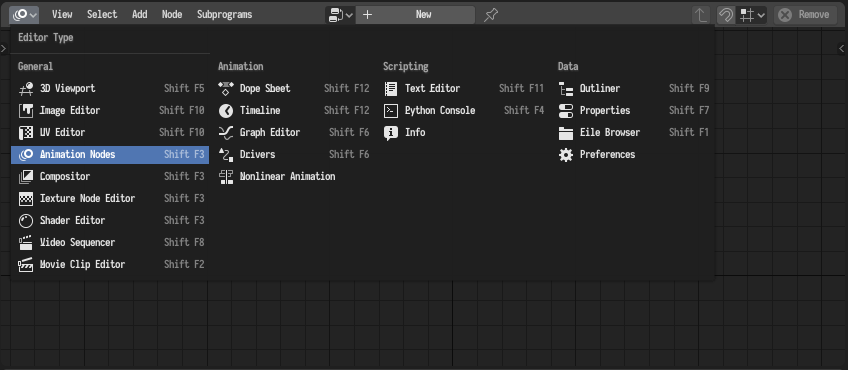

## Install

0. [Uninstall](#uninstall) any old version of Animation Nodes.
0. Download an appropriate build from the Animation Nodes
   [website](https://animation-nodes.com#download).
0. Go to the *Add-ons* section in the *User Preferences*.
0. Click *Install From File* and choose the zip file you downloaded.
0. Activate the add-on.

If everything worked correctly, you should see the Animation Nodes editor in
the editors menu.

{}

Checkout the [troubleshooting
guide](https://github.com/JacquesLucke/animation_nodes/issues/1240) if you have
any installation problems.

{}

{}

On Windows, Animation Nodes might cause Blender to take a very long time to
load, this is due to Windows Defender scanning Animation Nodes' libraries.
Possible solutions are discussed in the following
[thread](https://github.com/JacquesLucke/animation_nodes/issues/1531).

{}

## Uninstall

0. Disable the add-on and save the user preferences.
0. Restart Blender and remove Animation Nodes.

