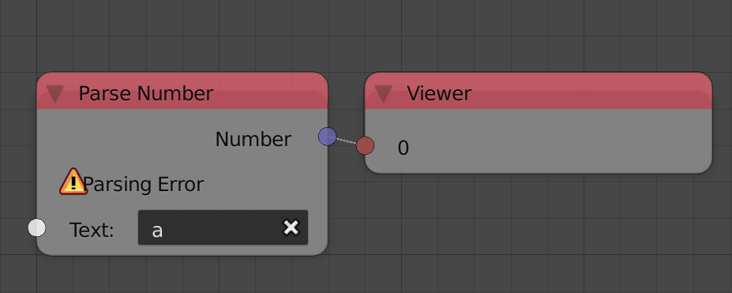

Animation Nodes takes your nodetree and converts it into a script, which
it then executes based on the execution options that we will present
below. You may notice that when you start using Animation Nodes, a
number starts to change very rapidly at the top left corner of the node
editor, that number is the time it took to execute the nodetree. By
default, Animation Nodes executes the nodetree as much as possible for
the best and smoothest update of the scene. However, this exhausts the
CPU and slows down other areas in Blender. It doesn't make sense to
execute the nodetree even if nothing changes in your nodetree or the
scene, so executing the nodetree that much may not be needed. Animation
Nodes provides an automatic and a manual execution system that suits
your needs. Execution system options are listed in the following
sections.

## Automatic Execution

By default auto execution is enabled and can be found in the *Auto
Execution* panel in the tool menu. Auto execution is controlled by a set
of options that we list below.

### Always

**Always** option is enabled by default and it does what we stated
before, that is, execute the nodetree as much as possible. This option
should not be used unless absolutely needed. A possible uses for it is
as follows:

  - A lot of variables that Animation Nodes uses in the scene are
    changing regularly and constantly, for instance, if the nodetree
    relies on the locations of tenths of objects that are constantly
    moving. Had they just been couple of object, then it would be better
    to use *triggers* (Triggers will be presented later on).
  - When running a time based discretized simulations that need to be
    computed as fast as possible.



Notice how Animation Nodes executes the nodetree constantly and
regularly even if nothing is changing, that is, the inputs and outputs
are always the same. (We realize that Animation Nodes is executing upon
seeing a change in the execution time, thats because the execution time
is nearly never the same due to many factors, even if the nodetree
didn't change)

If always is disabled, then you get to control the execution through the
options described below.

### Tree Changed

If enabled, the nodetree will execute every time the nodetree changes,
that is, a node is added or removed. It is probable that you need to
execute the nodetree every time you change something in your tree, so
this options should be enabled accordingly.



Notice how the tree executes whenever I add a new node.

### Frame Changed

If enabled, the nodetree will execute every time the current frame of
the scene changes. If your nodetree depends on the current frame, then
this option should be enabled.



Notice how the tree executes whenever the current frame changes.

### Property Changed

If enabled, the nodetree will execute every time a property changes,
that is, an input or an option of any of the nodes is changed. It is
probable that you need to execute the nodetree every time you change
something in your tree. Notice, however, that changing a value in the
*Advanced Node Settings* won't necessarily execute the nodetree even if
this option is enabled.



Notice how the tree executes when I change a value in the nodetree.

### Minimum Time Difference

This value defines the time between each two consecutive executions. So
if the value is set to one second, the nodetree will not execute unless
a second passes by, even if one of the conditions above were satisfied,
that is, a frame or property changed.

### Triggers

A Trigger is basically a “watcher” that you instruct to watch for a
change in some property you told it to watch. It, in turn, instructs
Animation Nodes to execute the node tree whenever the property it is
watching changes. For instance, lets say I am using the location of an
object in my node tree and I want to execute the node tree whenever the
location changes, in that case, I simply add a trigger and instruct it
to watch for the location of the object.



There are two options to define the property:

  - **Object Property** - An object is chosen and the property ID is
    defined relative to it. An example for such IDs are: `location`,
    `euler_rotation`, `location.x` ... .
  - **Scene Property** - A scene is chosen and the property ID is
    defined relative to it. If the scene `Scene` is chosen and the ID is
    `world.horizon_color`, then the full path of the property is
    `bpy.data.scenes["Scene"].world.horizon_color`.

## Errors

During the execution of the nodetree, some errors may be encountered,
those errors can either be fatal or not.

### Non-Fatal Error

Non-Fatal errors are reported per node. And they do not stop execution,
an example:

The *Parse Number Node* can't parse the letter `a`, it can only parse
numbers, so it returns an error saying that it can't parse this input.
Instead of stopping execution, it returns a *fall-back* value instead,
in this case, the default value of the number output, which is zero.

### Fatal Errors

Fatal errors stop the execution of the whole nodetree and have to be
solved. Such errors occur when you try to do something that the
developer didn't consider. Sometimes fatal errors persists even if you
resolve them, in that case, pressing the *Retry* button in the
*Execution* panel should get everything back to normal. Other times,
fatal errors will persists even if *Retry* is pressed, this is a known
bug, the only way to get the nodetree back to normal is to relaod the
file. Note that a fatal error could be a bug and should be reported. An
example for such error can be seen in the expression node:

The expression node has an option to *Debug* the expressions you write
before executing them, that is, identify if the expression is a valid
python code. I disabled the option for the second one and intentionally
made a syntax error. The first node reported the error as a non-fatal
error and didn't stop the execution, the second node, however, stopped
the execution and colored the node editor's borders red to indicate a
fatal error. To fix that error you just solve the syntax error or enable
*debug* option. Press *Retry* if that didn't resolve it.
