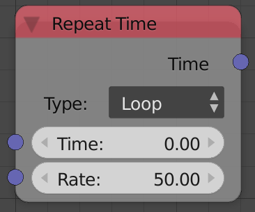

## Description

This node resets the time every n number of frames where n is the input
*Rate*. Technically it is the input *Time* modulo the input *Rate*.

## Options

## Inputs

- **Time** - An input time.
- **Rate** - A value at which the time will reset and start counting
    again.

## Outputs

- **Time** - The repeated time.

## Advanced Node Settings

- N/A

## Examples of Usage


