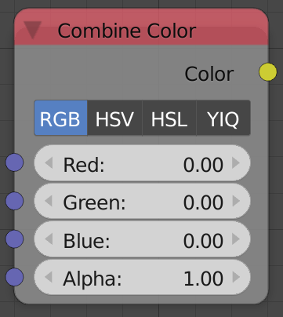

## Description

This node composes a color data from input individual channels. It
supports RGB, HSV, HSL and YIQ color models. All are in linear color
space.

## Inputs

Based on the choosen color model.

## Outputs

- **Color** - The output color data.

## Advanced Node Settings

- N/A

## Examples of Usage


