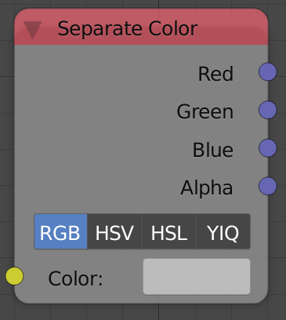

## Description

This node decomposes input color data and outputs its individual
channels. It supports RGB, HSV, HSL and YIQ color models. All are in
linear color space.

## Inputs

- **Color** - The input color data to decompose.

## Outputs

Based on the chosen color model.

## Advanced Node Settings

- N/A

## Examples of Usage


