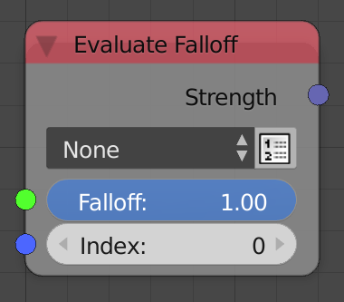

## Description

This node evaluate the input falloff at the input
index/vector/transformation matrix.

## Options

  - **Note** - The falloff is evaluated at the input index. Use this
    option when you have an index based falloff.
  - **Location** - The falloff is evaluated at the input vector. Use
    this option when you have a vector based falloff.
  - **Transformation Matrix** - The falloff is evaluated at the input
    transformation matrix. Use this option when you have a vector based
    falloff.
  - **Use List** - It is the option you see beside the menu. If enabled,
    the inputs will be lists and the node will evaluate the falloff at
    all the elements of the list.

## Inputs

  - **Falloff** - A falloff.
  - **Index** - The index to evaluate the falloff at.
  - **Location**- The vector to evaluate the falloff at. (Only in
    **Location** option)
  - **Matrix** - The transformation matrix to evaluate the falloff at.
    (Only in **Transformation Matrix** option)

## Outputs

  - **Strength** - The float at the input index/location/matrix.

## Advanced Node Settings

  - N/A

## Examples of Usage


