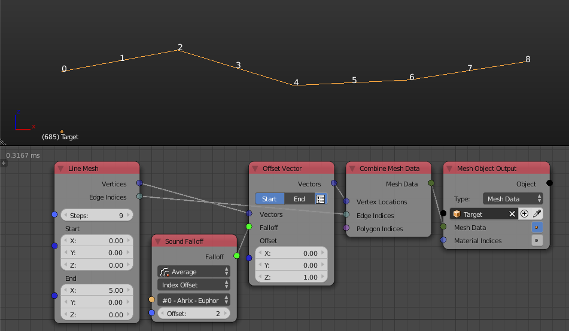
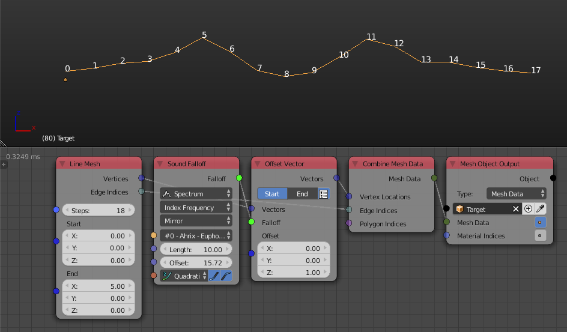
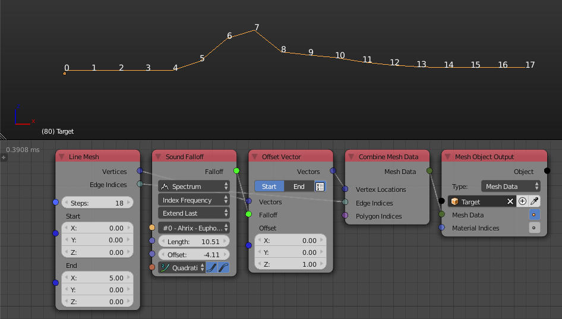

## Description

This node takes a sound and creates a falloff that associates a float to
every object where this float is the intensity of the input sound at a
single frequency or the average of the whole domain based on the
selected option. The falloff is evaluated either based on the index of
the object or based on another falloff. See options for more info.

## Options And Inputs

  - **Sound** - The input sound. The menu only displays the sounds of
    the same type as the **Sound Type**.

### Sound Type

### Average

This option associates the intensity of sound at the current frame to
the object at the index zero where objects at higher indices get
associated with sound intensities at future frames.

  - **Offset** - The number of objects till value becomes of the next
    frame. If the value is 1 then first object is associated with
    intensity at first frame, second object at the second frame. If the
    value is zero then all object will be associated with the intensity
    at the current frame. If it is higher than 1, then objects between
    each two consecutive frames get associated with a linear
    interpolation between the values at the bounding frames values. Look
    at the following illustration:

The vertex at index zero is associated with a float that represent the
intensity of the sound at the first frame, the intensity of the sound at
the next frame gets associated with the object at index 2 (Notice that
the input offset is set to 2), as for the objects that their index is
not multiple of the input offset, their value is a linear interpolation
between the bounding frame values, so object at index 1 lie on the line
that connect 0 and 2.

### Spectrum

This option associates the intensities of frequencies of the sound to
every object where objects with small indices or values gets associated
with the intensities of the low frequencies and objects with large
values or indices gets associated with intensities of the high
frequencies.

### Spectrum Falloff Type

#### Index Frequency

  - **Index Frequency** - The falloff is evaluated based on the indices
    of the objects.

The object at index zero got associated with the intensity of the first
frequency while object at index 1 got associated with the intensity of
the second frequency.

  - **length** - It is the distance between the lowest and highest
    frequency.

Notice that by reducing the length to half, the difference between the
low and high frequency got reduced to half and the highest frequency is
now at index 5 and not 9 as before.

  - **Offset** - This integer is added to the indices of the objects
    resulting in an offset of their frequencies.



  - **Index Frequency Extension Type** - This defines what happens to
    objects with indices that are out of the range. A length that is
    lower than the amount of indices would result in indices that are
    out of the range.
    
      - **Loop** - This will repeat the frequencies.
    
    
    
      - **Mirror** - This will repeat the frequencies in a ping pong
        style, so the end of the first range will match the end of the
        second range resulting in a mirror like effect.
    
    
    
      - **Extended** - This will associate the intensity of the lowest
        frequency to all the indices that are less than the start of the
        range and the intensity of the highest frequency to all the
        indices that are more than the end of the range. Notice how 0-4
        and 13-17 indices have the same intensity in the following
        example:
    
    

#### Falloff Frequency

  - **Falloff** - The falloff at which the sound falloff is evaluated.
    
    

In the above example a simple distance field is generated from the point
distance falloff, when we input it to the sound falloff, it gets
evaluated based on its values.

  - **Interpolation** - Output intensities are evaluated at this
    interpolation.

## Outputs

  - **Falloff** - The actual falloff object.

## Advanced Node Settings

### Fade To Zero

  - **Low Frequencies** - A frequency will be added at first which has a
    zero intensity. This make sure the first object always gets
    associated with a zero float.
  - **High Frequencies** - A frequency will be added at end which has a
    zero intensity. This make sure the last object always gets
    associated with a zero float.

## Examples of Usage


