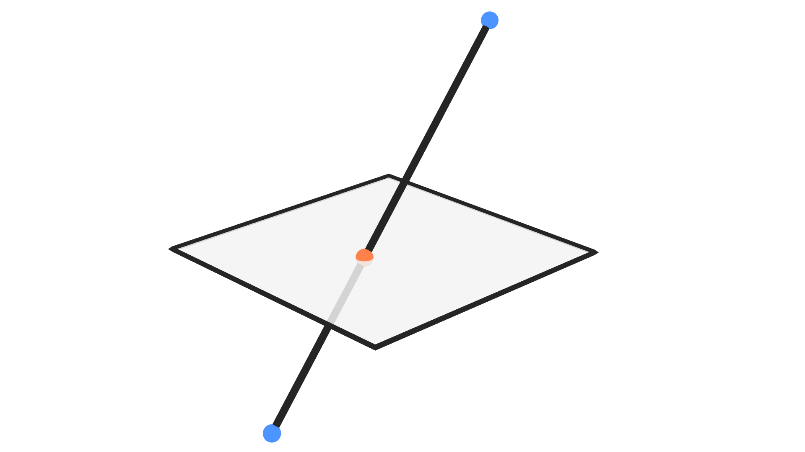

## Description

This node returns the location of the point of intersection of the input
line with the input plane.

## Illustration

Blue points are the input points and orange point is the intersection
with the input plane.

## Inputs

- **Line Start** - The location of the starting point of the line.
- **Line End** - The location of the ending point of the line.
- **Plane Point** - A point on the required plane.
- **Plane Normal** - A unit vector that represent the normal of the
    required plane.

## Outputs

- **Intersection** - The location of the point of intersection of the
    input line and input plane.
- **Is Valid** - A boolean which is True if an intersection was found
    and False otherwise. The intersection will not be found only when
    the line is perpendicular on the normal of the plane.
