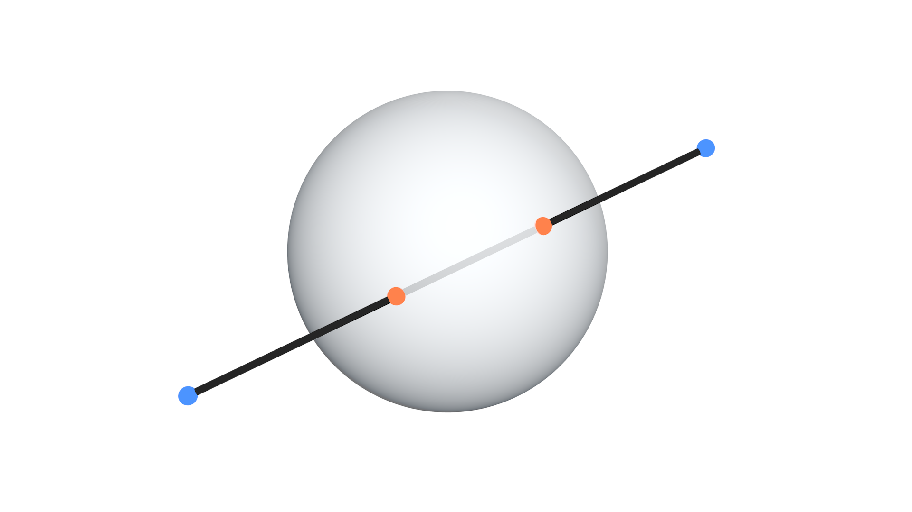

## Description

This node returns the locations of the points of intersections of the
input line with the input sphere. The line can intersect the sphere in:

- Two points, one time entering the sphere and another exiting it.
- One time, in which case, the line touches the sphere externally and
    is tangent to it at the point of intersection.
- No points.

## Illustration

Blue points are the input points and orange points are the intersections
with the input sphere.

## Options

- **Clip Inside Line** - If enabled, intersections that are not on the
    input line will be ignored. By default, your line define a straight
    line and not a segment, so points along that straight line are
    possible intersections.

## Inputs

- **Line Start** - The location of the starting point of the line.
- **Line End** - The location of the ending point of the line.
- **Sphere Center** - The location of the center of the required
    sphere.
- **Sphere Radius** - The radius length of the required sphere.

## Outputs

- **Intersection 1** - The location of the first point of intersection
    of the input line and input plane.
- **Intersection 1** - The location of the second point of
    intersection of the input line and input plane.
- **Is Valid 1** - A boolean which is True if the first intersection
    was found and False otherwise.
- **Is Valid 2** - A boolean which is True if the second intersection
    was found and False otherwise.

If one of the **Is Valid** is True and the other is False, then this
line is tangent to the sphere at the point of intersection.

## Advanced Node Settings

- N/A

## Examples of Usage


