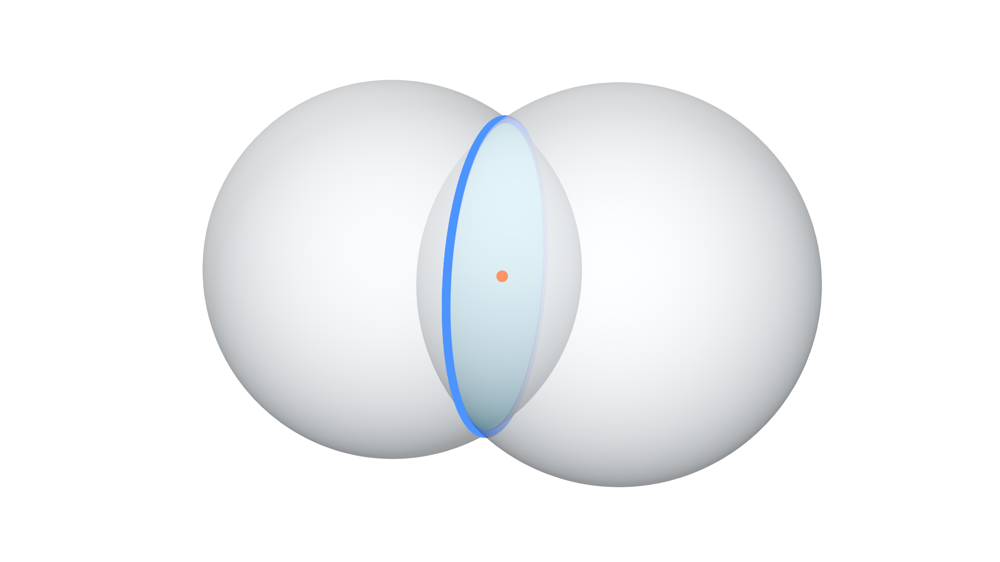

## Description

This node returns the intersection circle of the two input spheres. A
sphere intersects another sphere in a circle, the node returns the
radius, normal and center of the intersection circle.

## Illustration

Orange point is the center of the blue intersected circle.

## Inputs

- **Sphere 1 Center** - The location of the center of the first
    required sphere.
- **Sphere 1 Radius** - The radius length of the first required
    sphere.
- **Sphere 2 Center** - The location of the center of the second
    required sphere.
- **Sphere 2 Radius** - The radius length of the second required
    sphere.

## Outputs

- **Circle Center** - The location of the center of the intersected
    circle.
- **Circle Radius** - The radius length of the intersected circle. If
    this values is zero and *Is Valid* is True, that means that the
    spheres are touching at the *Circle Center*.
- **Is Valid** - A boolean which is True if an intersection was found,
    and False otherwise.
