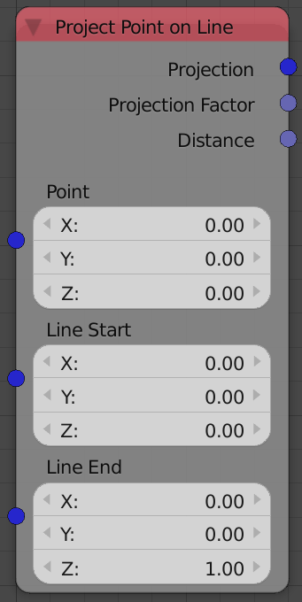
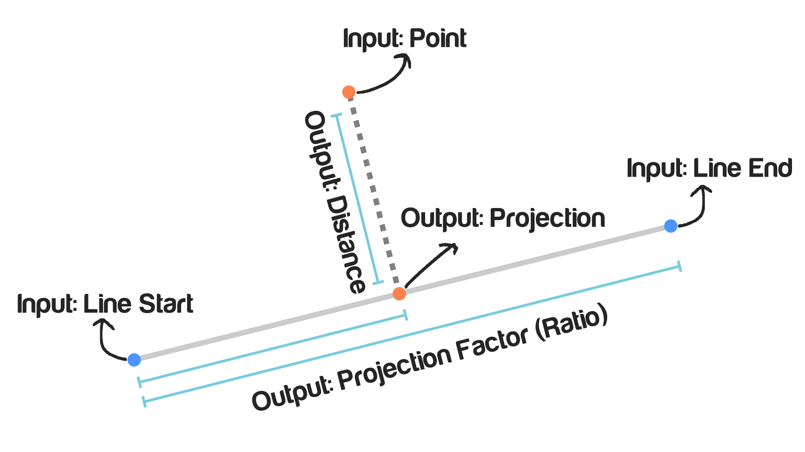

## Description

This node takes a point and a line and returns the projection of this
point on that line. The projection of a point on a line is the closest
point to the input point on the input line.

## Illustration

## Inputs

  - **Point** - The location of the point that will be projected.
  - **Line Start** - The location of the line starting point.
  - **Line End** - The location of the line ending point.

## Outputs

  - **Projection** - The location of the closest point on the line to
    the input point. Mathematically this point is the point that makes a
    perpendicular line to the input line.
  - **Projection Factor** - It is the ratio between the length of the
    line formed by the projected point and the input line's first point
    and the length of the input line. Or in more mathematical word, it
    is the scalar of the convex combination of the starting and ending
    point to get the projected point.
  - **Distance** - It is the shortest distance between the input point
    and the input line, which is also the distance between the projected
    point and the input point.

## Advanced Node Settings

  - N/A

## Examples of Usage


