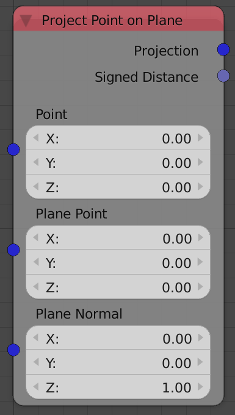
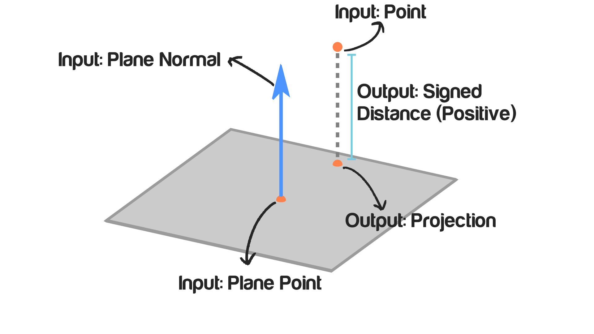

## Description

This node takes a point and a plane and returns projection of this point
on that plane. The projection of a point on a plane is the closest point
to the input point on the input plane.

## Illustration

## Inputs

  - **Point** - The location of the point that will be projected.
  - **Plane Point** - A point on the plane.
  - **Plane Normal** - The normal of the plane.

## Outputs

  - **Projection** - The location of the closest point on the plane to
    the input point. Mathematically this point is the point that makes a
    perpendicular line to the input plane which also makes a line that
    is parallel to the plane normal.
  - **Signed Distance** - It is the shortest distance between the input
    point and the input plane, Which is also the distance between the
    projected point and the input point. Although distances can't have a
    negative sign, this output could have a negative sign if the point
    lie below the plane while positive if above.

## Advanced Node Settings

  - N/A

## Examples of Usage


