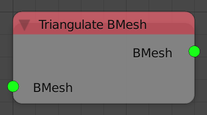

## Description

This node takes a bmesh data type and return a triangulated version of
it.

## Inputs

  - **BMesh** - A bmesh to triangulate.

## Outputs

  - **BMesh** - The triangulated bmesh.

## Advanced Node Settings

  - **Quad Method** - An integer that ranges between 0 and 3, it define
    the method used to perform triangulation of quads.
  - **Ngon Method** - An integer that is either 0 or 1, it define the
    method used to perform triangulation of Ngons.

## Examples of Usage


