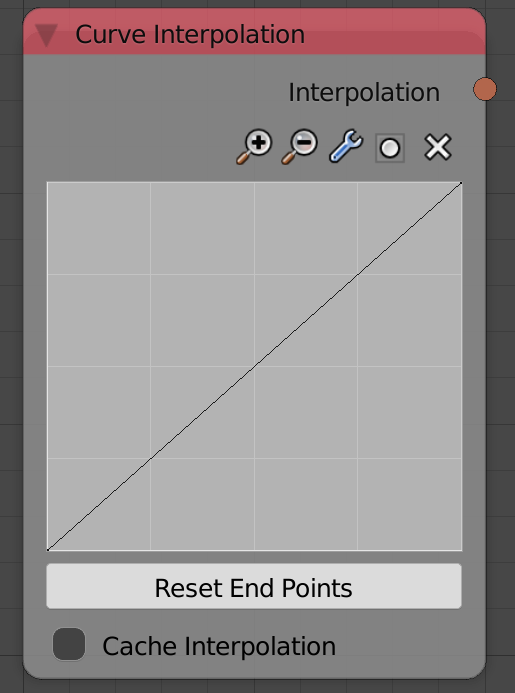

## Description

This node takes some points and returns an interpolation that represents
a spline interpolation of the input points (A function that satisfy all
the input points).

## Inputs

  - Editing the curve works just like blender's interpolation curve.
  - **Cache Interpolation** - If True, Interpolation will be cached
    allowing much faster evaluation.

## Outputs

  - **Interpolation** - An interpolation that represent a spline
    interpolation of the input points.

## Advanced Node Settings

  - N/A

## Examples of Usage


