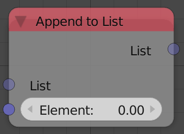

## Description

This node can be used to add an extra element at the end of the input
list.

## Inputs

- **List** - An input list.
- **Element** - An element to add to the input list. Indexed as the
    last element.

## Outputs

- **list** - The input list plus the extra element.

## Advanced Node Settings

- **Change type** - Change the type of the list to another list type.

## Examples of Usage


