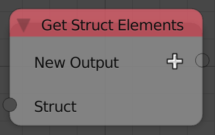
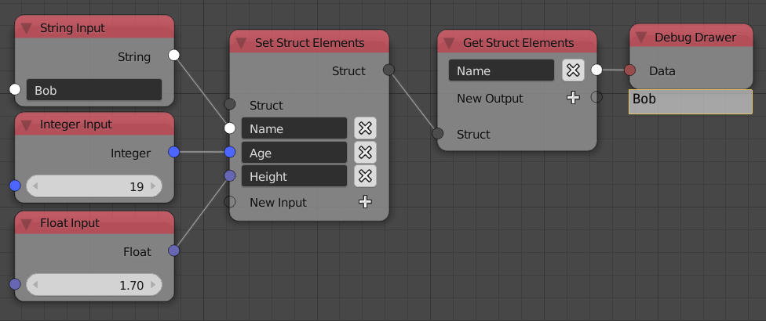

## Description

This node is used to get a value from a struct.

## Demonstration

This node doesn't output all the values of the struct, you have to
request what you want. Using the example we used in the `set_struct`
page. If we want to get the name of the person, we should add a string
output and type "Name" which is the key that store the name of the
person.

Getting such value in animation nodes :

## Inputs

- **Struct** - The input struct.

## Outputs

Based on what you add.

## Advanced Node Settings

- **Make Copies** - Copy the element before outputting it. This makes
    sure the element is independent of the original element in the
    struct and so changing that element won't affect the output.

## Examples of Usage


