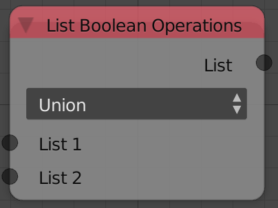

## Description

This node is used to do mathematical set operations like Union,
Intersection, Difference and Symmetric Difference.

## Options

- **Union** - This operation adds the 2 input lists but unlike the
    combine list node. If an element is shared between the 2 lists it
    will be considered as a single element. So input list `[1,2,3]`
    Union input list `[3,4,2]` outputs `[1,2,3,4]`.
- **Intersection** - This node will return a list of elements that are
    common between the 2 input lists. So input list `[1,2,3]`
    intersection input list `[3,4,5]` outputs `[3]`, because it is
    shared between the 2 lists.
- **Difference** - This operation will remove the elements of input
    list 1 from input list 2. So if input list `[1,2,3]` difference
    input list `[3,4,5]` outputs `[1,2]`. Notice that 3 was removed
    because it is in list 2.
- **Symmetric Difference** - This operation return the elements from
    both lists if those elements are not shared between both lists. So
    input list `[1,2,3]` Symmetric Difference input list `[3,4,5]`
    output `[1,2,4,5]`. Notice that 3 was not included because it is in
    both lists.

## Inputs

- **List 1** - An input list.
- **List 2** - An input list.

## Outputs

- **List** - The result of the set operation.

## Advanced Node Settings

- NA

## Examples of Usage


