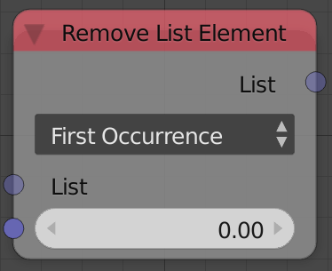

## Description

This node removes certain list elements based on their index or their
values.

## Options

- **First Occurrence** - This option removes the input value at its
    first appearance only. So if the input value is
    1 and the input list is `[1,2,3,1]`
    the output list will be `[2,3,1]`. Notice that the last 1 didn't
    change.
- **All Occurrence** - This option removes all the input values from
    the list. So for the previous example the output list will be
    `[2,3]`.
- **Index** - This option removes the element at the input index. So
    for the previous example with input index as 1 then the output will
    be `[1,3,1]` because 2 was at index 1.

## Inputs

- **List** - An input list.
- **Value/Index** - The index of the element or its value (Based on
    the selected option).

## Outputs

- **List** - The edited list.

## Advanced Node Settings

- **Change type** - Change the type of the list to another list type.

## Examples of Usage


