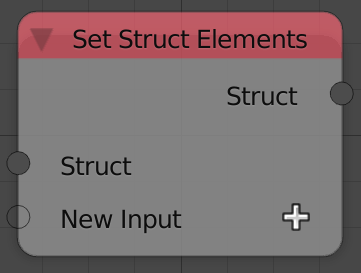
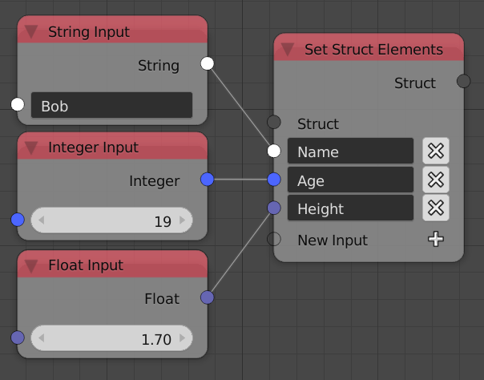

## Description

This node creates struct elements and sets their values. See
demonstration for more information about struct elements.

A new key can be added using the plus button or by plugging its value
into the transparent socket.

## Demonstration

Struct elements are not lists. They are what is known as dictionaries.
Dictionaries are lists but each element is known by a **Keys** instead
of an index. A key is a string that usually explain the value it is
carrying. Dictionaries unlike lists don't care about the elements order.
Dictionaries can carry multiple data types.

An example of a dictionaries : Name = Bob, Age = 19, Height = 1.70 .
Notice That every element has a key (Name,Age,Height) that describe its
value (Bob,19,1.70) also notice that the values can be of any data type
(String,Integer,Float) it can even have a dictionary as a value.

Creating such dictionaries in animation nodes :

## Inputs

- **Struct** - The node can also be used to add keys to an existing
    struct and this input is where the original struct is input.

## Outputs

- **Struct** - The input struct.

## Advanced Node Settings

- NA
