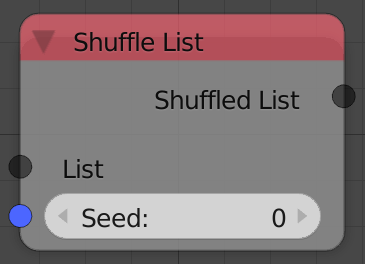

## Description

This node redistributes the elements of the list in a random different
order.

## Inputs

- **List** - An input list.
- **Seed** - A seed for the random generator, where different seeds
    output elements in different orders.

## Outputs

- **Shuffled List** - The list after random redistribution of the
    elements.

## Advanced Node Settings

- N/A

## Examples of Usage


