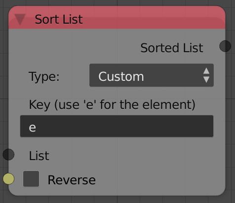

## Description

This node sorts a list of a specific data type based on a specific
property. The input list can be of any data type and there is two main
options you can use for sorting:

- Custom expression.
- key list.

## Options

- **Custom** - This option lets you sort the list based on an input
    data attribute. So if the list data type is vectors, you can use the
    expression `e.x` which will sort the vectors based on their x
    component (from the smallest x to the largest x). Another example,
    if the list data type is stings you can use the expression `e[-1]`
    to sort the strings based on their last characters (starting from A
    to Z). Notice that -1 here is the index of the last character in the
    string.
- **key List** - This option lets you sort list using a reference
    list. The reference list can be either floats or strings. Suppose I
    want to sort the list `[1,2,3,4]` to be `[3,1,2,4]`, the reference
    list for such ordering would be something like `[1,2,0,3]` this
    reference list gets sorted from zero to infinity and the same
    movement that happened to sort this list will happen to the original
    list. So for instance, the number 0 in the reference list is the
    smallest number and thus it should be the first element so we move
    it from the third location to the first location. That same movement
    will happen to the original list, the element at the third
    location(which is 3) will move to the first location (Notice that
    this is what happened to get `[1,2,3,4]` to be `[3,1,2,4]`). The
    string reference list is exactly the same but it is sorted from A to
    Z and an alternative reference list in strings for `[1,2,0,3]` is
    `[b,c,a,d]`.

## Inputs

- **List** - An input list.
- **Key** - The reference list if Key list option is chosen.
- *Reverse* - An option to reverse the order of the output list.

## Outputs

- **Sorted List** - The sorted list.

## Advanced Node Settings

- **Element** - The variable used to define the elements of the input
    list in the custom expression option. By default it is "e".

## Examples of Usage


