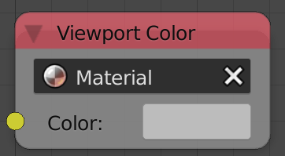

## Description

This node lets you set the viewport color of the selected material. It
works for both cycles and internal materials.

## Inputs

  - **Color** - The viewport color.

## Outputs

  - N/A

## Advanced Node Settings

  - N/A

## Examples of Usage


