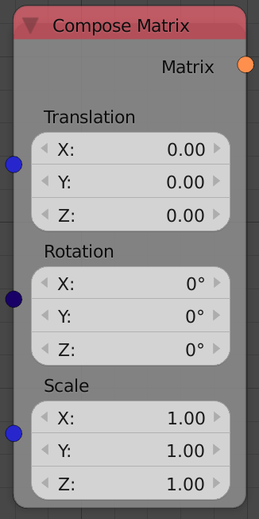

## Description

This node forms a transformation matrix based on the input translation,
rotation, and scaling.

## Inputs

  - **Translation** - A vector that stores the amount of translation of
    the output matrix.
  - **Rotation** - An euler that stores the amount of rotation of the
    output matrix.
  - **Scale** - A vector that stores the amount of scaling of the output
    matrix.

## Outputs

  - **Matrix** - A 4x4 transformation matrix which can be used to apply
    linear transformations to an object.

## Advanced Node Settings

  - N/A

## Examples of Usage


