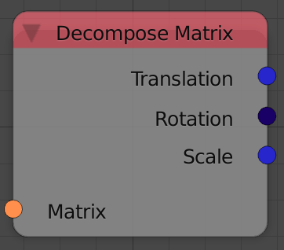

## Description

This nodes takes transformation matrix and returns its components
including rotation, translation and scale.

## Inputs

- **Matrix** - A matrix to decompose.

## Outputs

- **Translation** - A vector that stores the amount of translation in
    the input matrix, which is also the location of the object.
- **Rotation** - An euler that stores the amount of rotation in the
    input matrix, which is also the rotation of the object.
- **Scale** - A vector that stores the amount of scalling in the input
    matrix, which is also the scale of the object.

## Advanced Node Settings

- N/A

## Examples of Usage


