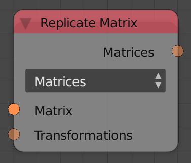

## Description

This node copy the input matrix multiple times then transforms each new
copy based on a corresponding transformation matrix or a translation
vector. The transformations are input as a list of matrices or vectors
where its length is the number of copies.

## Options

The transformations can either be defined by matrices which support
translation, rotation and scaling or by vectors that only support
translations.

- **Matrices** - This option lets you define the transformations using
    a transformation matrix list.
- **Vectors** - This option lets you define the translations using a
    vector list.

## Inputs

- **Matrix** - Original matrix.
- **Matrices** - A list of transformation matrices that defines the
    transformations applied on the copies where the first matrix is
    applied on the first copy, second on second and so on.
- **Vectors** - A list of vectors that defines the translations
    applied on the copies where the first translation is applied on the
    first copy, second on second and so on.

## Outputs

- **Matrices** - New matrices.

## Advanced Node Settings

- N/A

## Examples of Usage


