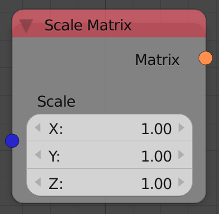

## Description

This node generates a scale transformation matrix based on an input
vector. The transformation matrix can then be multiplied to a matrix to
perform the scaling.

## Inputs

  - **Scale** - A vector that stores the amount of scaling in the output
    transformation matrix.

## Outputs

  - **Matrix** - A transformation matrix that contains the scale
    information.

## Advanced Node Settings

  - N/A

## Examples of Usage


