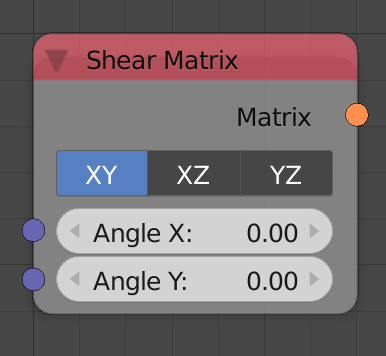

## Description

This node generates a shear transformation matrix based on an input
angle. The transformation matrix can then be multiplied to a matrix to
perform the shearing.

Shearing is changing the coordinates in an axis based on the coordinates
of another axis.

## Inputs

- **Angle X,Y,Z** - Shear amount in X,Y,Z axis.

## Outputs

- **Matrix** - A transformation matrix that contains the shearing
    information.

## Advanced Node Settings

- N/A

## Examples of Usage


