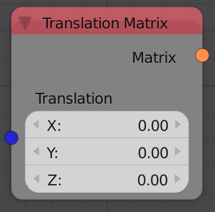

## Description

This node generates a translation transformation matrix based on an
input vector. The transformation matrix can then be multiplied to a
matrix to perform the translation.

## Inputs

  - **Translation** - A vector that stores the amount of translation in
    the output transformation matrix.

## Outputs

  - **Matrix** - A transformation matrix that contains the translation
    information.

## Advanced Node Settings

  - N/A

## Examples of Usage


