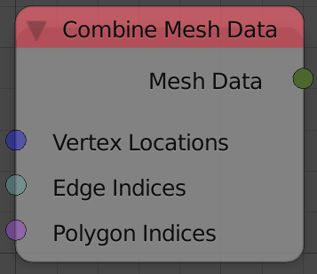

## Description

This node combines individual mesh data into a mesh data block.

## Inputs

- **Vertex Locations** - A vector list that contains the locations of
    the vertices of the input mesh data.
- **Edges Indices** - An edge indices list that contains the edge
    information of the input mesh data.
- **Polygons Indices** - A polygon indices list that contains the
    polygon information of the input mesh data.

## Outputs

- **Mesh Data** - A mesh data.

## Advanced Node Settings

- N/A

## Examples of Usage


