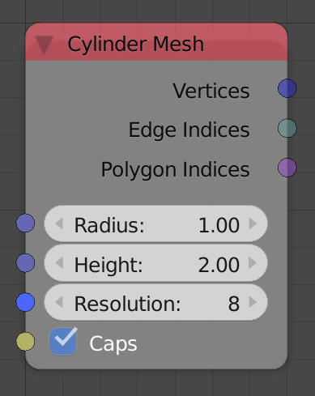

## Description

This node return the mesh data of a cylinder.

## Inputs

  - **Radius** - Radius of the cylinder.
  - **Height** - Height of the cylinder.
  - **Resolution** - Number of vertices per loop that forms the
    cylinder.
  - **Caps** - If enabled, the top and bottom of the cylinder will be
    filled with an Ngon.

## Outputs

  - **Vertices** - The vertices locations of the cylinder.
  - **Edge Indices** - The edge indices of the cylinder.
  - **Polygon Indices** - The polygon indices of the cylinder.

## Advanced Node Settings

  - N/A

## Examples of Usage


