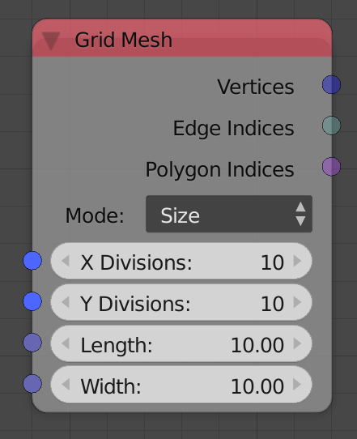

## Description

This node return the mesh data of a 2d grid based on the input data.

## Options

  - **Size** - This option lets you set the dimension of the grid.
  - **Step** - This option lets you set the dimensions of each
    individual cell.

## Inputs

  - **X Divisions** - The number of lines in the x direction.
  - **Y Divisions** - The number of lines in the y direction.
  - **X Distance** - The distance between lines in x direction. (Only
    available in Step option)
  - **Y Distance** - The distance between lines in y direction. (Only
    available in Step option)
  - **Length** - The length of the grid. (Only available in Size option)
  - **Width** - The width of the grid. (Only available in Size option)

## Outputs

  - **Vertices** - The vertices locations of the grid.
  - **Edge Indices** - The edge indices of the grid.
  - **Polygon Indices** - The polygon indices of the grid.

## Advanced Node Settings

  - N/A

## Examples of Usage


