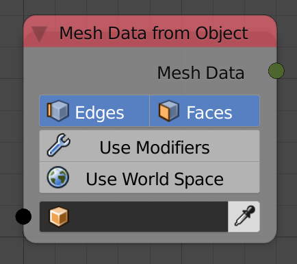

## Description

This node returns the mesh data of the input object.

## Options

- **Edges** - If enabled, edges will be included in the output mesh
    data.
- **Faces** - If enabled, faces will be included in the output mesh
    data.
- **Use Modifiers** - If enabled, the output mesh data will be
    computed after modifiers are applied.
- **Use World Space** - If enabled, vertices locations will be in
    world space coordinates.

## Inputs

- **Object** - An object to return its mesh data.
- **Scene** - The scene the object belong to.

## Outputs

- **Mesh Data** - The mesh data of the input object.

## Advanced Node Settings

- N/A

## Examples of Usage


