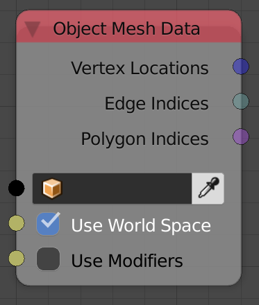

## Description

This node returns some information about the input object like its
vertices locations and polygon edge indicies.

The data is from blender's object data block, which means, when the
object is edited in edit mode, **AN** won't update the output data
unless you change to object mode.

## Inputs

- **Object** - An object.
- **Use World Space** - This option lets you choose between local and
    global coordinate space for the outputs.
- **Use Modifiers** - If enabled, will return the data as modifiers
    were applied, that includes both the generative and deformative
    modifiers.
- **Scene** - The scene the object belong to.

## Outputs

- **Vertex Locations** - A vector list that includes vertices
    locations of the input object.
- **Edge Indices** - A list of edge indices that includes all the
    edges of the input object.
- **Polygon Indices** - A list of polygon indices that includes all
    the polygons of the input object.
- **Vertex Normal** - A vector list that contain unit vectors that
    represent the vertices normals of the input object.
- **Polygon Centers** - A vector list that contain the locations of
    the centers of the polygons of the input object. It is computed as
    the average of vertices of the polygon.
- **Polygon Normals** - A vector list that contain unit vectors that
    represent the normals of the polygons of the input object.
- **Local Polygon Area** - A float list that contain the areas of the
    polygons of the input object.
- **Material Indices** - An inter list that contains the material
    index for each polygon, where the first integer represent the index
    of the material assigned to the first polygon, ...
- **Mesh Name** - A string that contains the name of the mesh.

## Advanced Node Settings

- N/A

## Notes

- **Mesh Name** output is not the object name\! It the the name of
    mesh data block that define the geometry of the object. In blender
    you can find that name in the *Data Panel*.

## Examples of Usage


