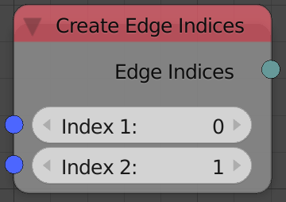

## Description

This node creates an edge indices which then can be used to create an
edge indices list to create meshes.

## Inputs

- **Index 1** - The index of the first vertex.
- **Index 2** - The index of the second vertex.

## Outputs

- **Edge Indices** - The resulted edge indices.

## Advanced Node Settings

- N/A

## Examples of Usage


