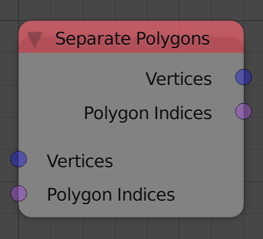

## Description

This node separate input polygons.

## Inputs

- **Vertices** - A vector list that represent the vertices locations
    of the polygons.
- **Polygon Indices** - A polygon indices that define the polygons.

## Outputs

- **Vertices** - The vector list that represent the vertices locations
    of the separated polygons.
- **Polygon Indices** - A polygon indices list that define the
    separated polygons.

## Advanced Node Settings

- N/A

## Examples of Usage


