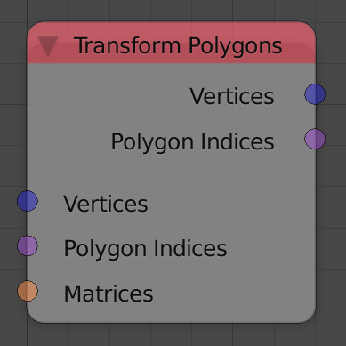

## Description

This node transforms input polygons based on an input transformation
matrix.

## Inputs

- **Vertices** - A vector list that represent the locations of the
    vertices of the polygons.
- **Polygon Indices** - The polygon indices list of the polygons.
- **Matrix** - A transformation matrix.

## Outputs

- **Vertices** - The transformed vertices locations.
- **Polygon Indices** - The input polygon indices.

## Advanced Node Settings

- N/A

## Examples of Usage


