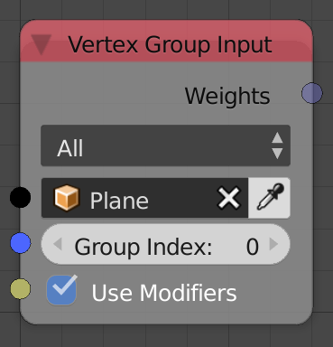

## Description

This node returns the weight(s) of the vertices in vertex groups.

## Options

  - **All** - The output will be a float list that contain all the
    weights of the choosen vertex group.
  - **Index** - The output will be a single float that contain the
    weight of the vertex at the input index.

## Inputs

  - **Object** - The object.
  - **Group Index** - The index of the vertex group. (See Advanced Node
    Settings)
  - **Index** - The Index of the vertex to sample its weight. (Only in
    Index option)
  - **Use Modifiers** - If enabled, the values of the weights will be
    sampled after mdofiers are applied. (Only in All option)

## Outputs

  - **Weight(s)** - The weights.

## Advanced Node Settings

  - N/A

## Examples of Usage


