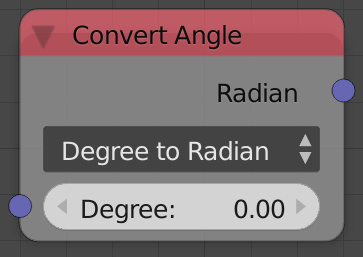

## Description

This node allows you to convert from *Degrees* to *Radians* or from
*Radians* to *Degrees*.

Generally, degrees should not be used in node trees because almost all
nodes expect radians including trig functions, so if degrees were used
for some reason, this node can be used to convert them into radians.

## Options

- **Degree To Radian** - Converts input degree angle to radian.
- **Radian To Degree** - Converts input radian angle to degree.

## Inputs

- **Degree/Radian** - The angle to convert.

## Outputs

- **Degree/Radian** - The converted angle.

## Advanced Node Settings

- N/A

## Examples of Usage



Sine and Cosine expects radians so if I want to input degrees I have to
convert them into radians first:


