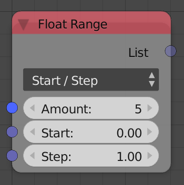

## Description

This node is used to generates a float list that represents an
arithmetic sequence.

## Options

  - **Start/Step** - This option allows you to define the arithmetic
    sequence by a starting value and a *Step* value which is the
    difference between each two consecutive terms.
  - **Start/Stop** - This option allows you to define the arithmetic
    sequence by a starting value and an end value. In this case, the
    difference between each two consecutive terms is the reciprocal of
    the *Stop* value.

## Inputs

  - **Amount** - The length of the arithmetic sequence which is also the
    length of the output integer list.
  - **Start** - It is the starting value of the arithmetic sequence.
  - **Step** - It is the difference between each two consecutive terms
    of the arithmetic sequence. (Only available in the *Start/Step*
    option)
  - **Stop** - It is the end value of the arithmetic sequence, in this
    case, the difference between each two consecutive terms is the
    reciprocal of its value. (Only available in the *Start/Stop* option)

## Outputs

  - **Float List** - A float list that contains the generated floats.

## Advanced Node Settings

  - N/A

## Examples of Usage



This node can be used whenever an arthmetic sequence is needed, for
instance, using its output as a parameter for parameteric equations:



Or as an input for simple explicit functions:


