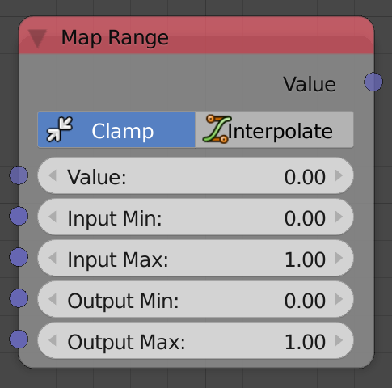

## Description

This node remaps a value from an interval to a new interval.

Every value has a relative position in a specific interval, for
instance, `1` is positioned in the middle of the interval `[0,2]`, if we
remap it to the interval `[0,8]`, it will be `4` because it is
positioned at the midpoint of that interval. See examples for more info.

## Options

  - **Clamp** - If enabled, values will be clamped to the interval
    `[0,1]`.
  - **Interpolation** - If enabled, values will be evaluated at the
    input interpolation before being output. (Only available when clamp
    is enabled, as interpolations work on normalized intervals only)

## Inputs

  - **Value** - A float that should be remaped.
  - **Input Min** - The start of the original interval.
  - **Input Max** - The end of the original interval.
  - **Output Min** - The start of the new interval.
  - **Output Max** - The end of the new interval.
  - **Interpolation** - If *Interpolation* is enabled, the output value
    will be evaluated based on this input interpolation.

## Outputs

  - **Value** - The value after remapping

## Advanced Node Settings

  - N/A

## Examples of Usage

The usage of the node can be understood by studying the next two
examples. We generate a list of floats that ranges between `-1` and `1`
and use it as our input values, we then set the new *min* and *max* to
whichever values we want to define the new interval with:



If *Interpolation* is enabled, the values will be evaluated at the input
interpolation, the geometrical interpretation for that is that the
differences between the values will change, for instance, the sinusoidal
interpolation will result in the values at the start and end of the
interval be compressed together, try to experiement with different
interpolations to understand this better:



If we are oscillating the location of an object using a cosine function,
it will oscillate in the range `[-1,1]`, we can use the map range node
to make it oscillate in the range `[0,1]` instead:


