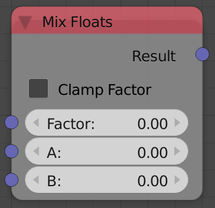

## Description

This node linearly mixes between two floats based on a factor.

## Options

  - **Clamp** - If enabled, a factor that is larger than one will be
    rendered one and a factor that is negative will be rendered zero.
    Subsequently, the output will be in the range of the input floats.
    If disabled, the result is computed based on the equation
    A(1-F)+B\*F (Where
    F is the factor,
    A and
    B are the first and second floats)
    which accordinging may result in strange results for negative
    factors or factors that are larger than one.

## Inputs

  - **Factor** - A float that controls the amount of each float input to
    the output, Where 0 means the first float only and 1 means the
    second float only.
  - **A** - First float.
  - **B** - Second float.

## Outputs

  - **Result** - The result of mixing the two floats by the factor.

## Advanced Node Settings

  - N/A

## Examples of Usage


