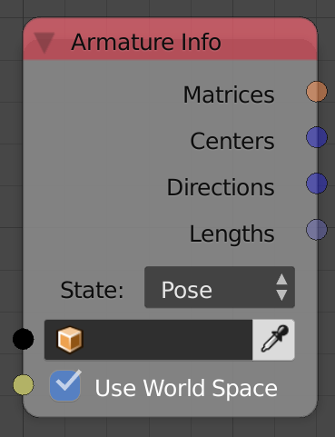

## Description

This node return some information about the bones of the input armature.

## Options

- **Pose** - The information is retuned in the pose position of the
    bones.
- **Rest** - The information is returned in the rest position of the
    bones.

## Inputs

- **Object** - The armature object.
- **Use World Space** - Locations and matrices will be in global space
    in this is True.

## Outputs

- **Matrices** - A transformation matrices that represent the
    locations, rotations and scales of the bones.
- **Centers** - A vector list that represent the locations of the
    centers of the bones.
- **Directions** - A vector list that represent the directions of the
    bones. The magnitude of each direction vector is equal to the length
    of the bone.
- **Lengths** - The lengths of the bones.
- **Heads** - A vector list that represent the locations of the heads
    of the bones.
- **Tails** - A vector list that represent the locations of the tails
    of the bone.
- **Names** - A text list that contains the names of the bones.

## Advanced Node Settings

- N/A

## Examples of Usage


