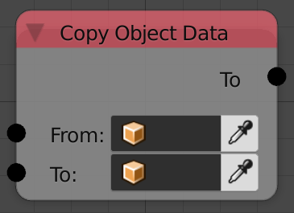

## Description

This node copies the data of one object to another. (They become linked)

## Inputs

  - **From** - An object to copy from.
  - **To** - An object to copy to.

## Outputs

  - **To** - The copied to object.

## Advanced Node Settings

  - N/A

## Examples of Usage


