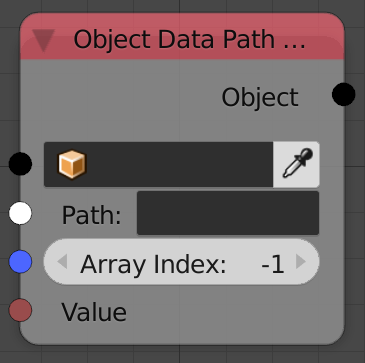

## Description

This node behaves just like the **Object Attribute Output**, but it is
more convenient to use with lists where for instance the location of the
object has 3 values (X,Y,Z), this node will let you set the value for
any of them independently.

To get the data path of any property just right click on the property
and select **Copy Data Path**.

## Inputs

  - **Object** - An object.
  - **Path** - The data path of the property.
  - **Array Index** - The index of the property to edit. Where the first
    element indexed as zero and the third as 2.
  - **Value** - The value of the property to edit.

## Outputs

  - **Object** - The input object.

## Advanced Node Settings

  - **Clear Cache** - The node automatically cache data paths for faster
    future executions, pressing this would clear that cache.

## Examples of Usage


