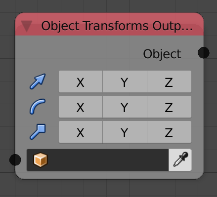

## Description

This node sets the location, rotation, and scale of the input object to
the input transformations.

To output a property, enable its representative check box.

## Inputs

  - **Object** - An object.
  - **Location** - A vector that contains the location of the object.
  - **Rotation** - An euler that contains the rotation of the object.
  - **Scale** - A vector that contains the scale of the object.

## Outputs

  - **Object** - The input object.

## Advanced Node Settings

  - **Delta Transforms** - If enabled, the node will edit the delta
    transforms of the object instead of the transforms themselves. Delta
    transforms are transforms that are added to the original transforms
    of the object, they are very useful if you want to set the object's
    location relative to its original location.

## Examples of Usage


