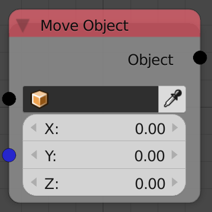

## Description

This node move the input object by the input vector every node
execution.

## Inputs

- **Object** - An object to move.
- **Displacement** - The displacement vector by which the object move
    each execution.

## Outputs

- **Object** - The input object.

## Advanced Node Settings

- N/A

## Examples of Usage


