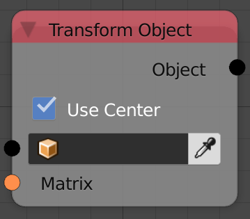

## Description

This node transform the input object by the input transformation matrix
every node execution.

## Inputs

  - **Object** - An object to move.
  - **Matrix** - The transformation matrix by which the object transform
    each execution.

## Outputs

  - **Object** - The input object.

## Advanced Node Settings

  - **Use Center** - This will use the object's current location as the
    origin of transformation.

## Examples of Usage


