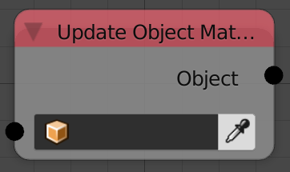

## Description

Blender doesn't update the object's transformation matrix immediately
after modifying the transformation, So you can use this node to update
it.

## Inputs

- **Object** - An object.

## Outputs

- **Object** - The input object.

## Advanced Node Settings

- N/A
