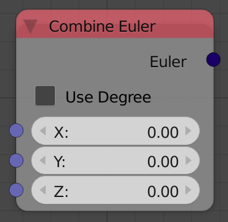

## Description

This node composes an euler from X,Y,Z components.

## Inputs

- **X** - The X component of the euler in radian.
- **Y** - The Y component of the euler in radian.
- **Z** - The Z component of the euler in radian.

**Note:** You can input degrees by checking **Use Degree**.

## Outputs

- **Euler** - The composed euler.

## Advanced Node Settings

- N/A

## Examples of Usage


