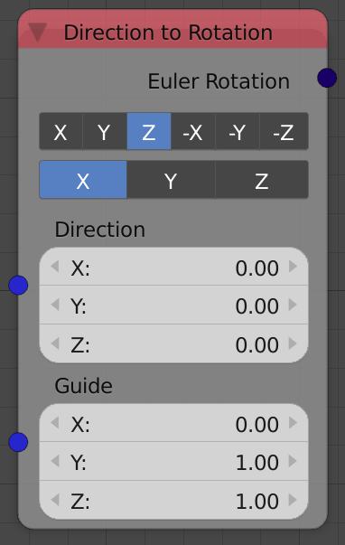

## Description

This node converts a direction to a rotation, A vector that defines a
direction is inputed and a corresponding rotation is outputed.

## Demonstration

To better understand how this node works, You can think of it as
aligning the local **Track Axis** of the object to the input **Direction
Vector**.

It is true that the selected local **Track Axis** is locked to the input
direction vector, but that means the object can still rotate around that
vector while maintaining its direction. This node enables you to guide
the object rotation around that axis using another vector, **Guide
Vector** and **Guide Axis**.

You can also think of the guiding feature as aligning the local **Guide
Axis** of the object to the input **Guide Vector**.

Here is an example where the **Track Axis** is set to Z and the **Guide
Axis** is set to X.



## Inputs

  - **Direction** - The vector that defines the direction, can be
    normalized or not.
  - **Guide** - The vector that define the rotation around the
    **Direction Vector**.

## Outputs

  - **Euler Rotation** - The resultant rotation in the form of Euler
    Rotation.

## Advanced Node Settings

  - N/A

## Warning

  - The **Track Axis** can never be the **Guide Axis** because The
    **Track Axis** is already locked to the **Direction Vector**.

## Examples of Usage


